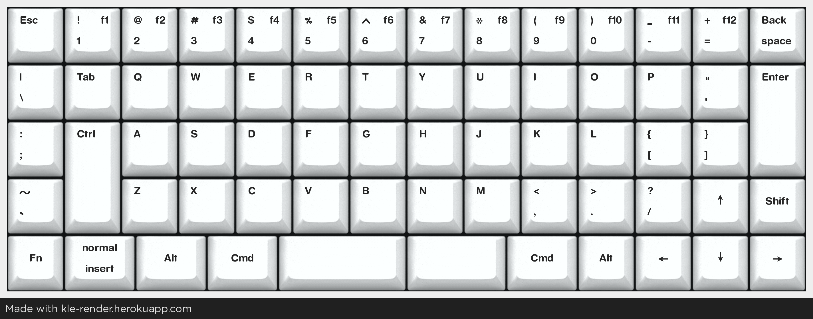

# My weird split keyboard

My first 3D printed keyboard. The keyboard will be split in the middle, but both parts will have magnets to "stick" to each other in a correct position.

Some cable will probably connect both parts. Ideally, either on the top, or a springloaded cable on the sides.

## Layout (thoughts)

- I might move `Esc` down and decrease the size of `Tab` to one. So, `Esc` and `Tab`. Then `Backspace` could be two keys!
- I'll have to think more about positions of special keys. Reachability and position. I might also make them only accessible with `Fn` keys to shrink the keyboard even more (or increase the size of important keys, like `Enter`, `Shift`)
  - For example, make the bottom-left keys programmable. Also, maybe decrease the size of `Fn`, because it looks kinda stupid.
- Special key for stuff like Vim.
- Remove `LAlt` as I don't seem to be using it anyway.
